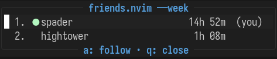

Ah, `neovim`. A safe haven, away from the bloat of modern software, away from
the stench of startups funded through complex private equity schemes. A good
place where everything works the way it ought to. The though of it brings a
peaceful, quiet smile to your face, like a gentle sunbeam.

Wait, no. No! All of this quietness and solitude has left me alone with my own
thoughts! Damn you, `neovim`! There must be a solution...

# friends.nvim

`friends.nvim` lets you and your friends see when you're online. Plus, it keeps
a global leaderboard of your `neovim` usage!

[](.github/screenshot.png)
<p align="center">
    
</p>

## installation

### lazy.nvim

```lua
{ "tspader/friends.nvim", opts = {} }
```

### vim-plug

```vim
Plug 'tspader/friends.nvim'
```

## usage

On first boot, `friends.nvim` will register and assign you a public handle
and a "private" key. It's "private" because this data is completely meaningless
and no one gives a shit, but it'll stop the most basic griefing.

You add friends by handle. To print your handle and key:

```vim
:Friends key
```

Your friend can then add you:

```vim
:Friends add $handle
```

You can change your display name for the leaderboard:

```vim
:Friends name spader
```

Which leaderboard you can check out like so:

```vim
:Friends list
```

Or, if you want the global leaderboard, which I am dominating btw:

```vim
:Friends
```

Go ahead and let that global leaderboard rip. Just give that command a little
run and check out the name at the top. Man, look at that number. Just give that
number a tiny little readarooni. That's a big fucking number. My life ie
meaningful and I am fulfilling my destiny. Just check that leaderboard real
quick.

Have you been crunching hard today, but your number is still smaller than your
friends' because they spent the last week doing their day job while you took
a (well deserved) vacation? Hit `t` to switch the ranking period to `today` and
let your usual smugness return.

You can directly switch the ranking period with `t`/`w`/`A` to jump to
today/week/all-time, use `<Tab>`/`<S-Tab>` to cycle through them, and `p` to
open a picker.

You can also sync up to your handle on another machine by taking the handle
and key from `:Friends key` and passing it to `:Friends claim`
